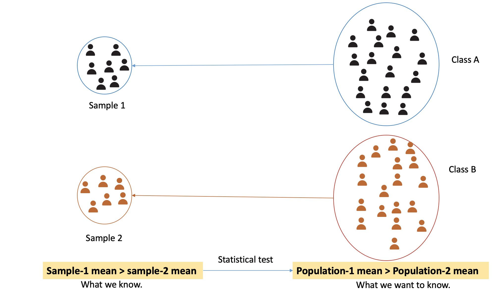
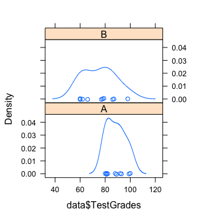
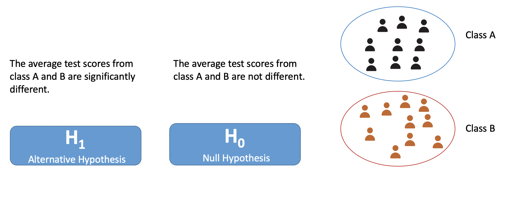
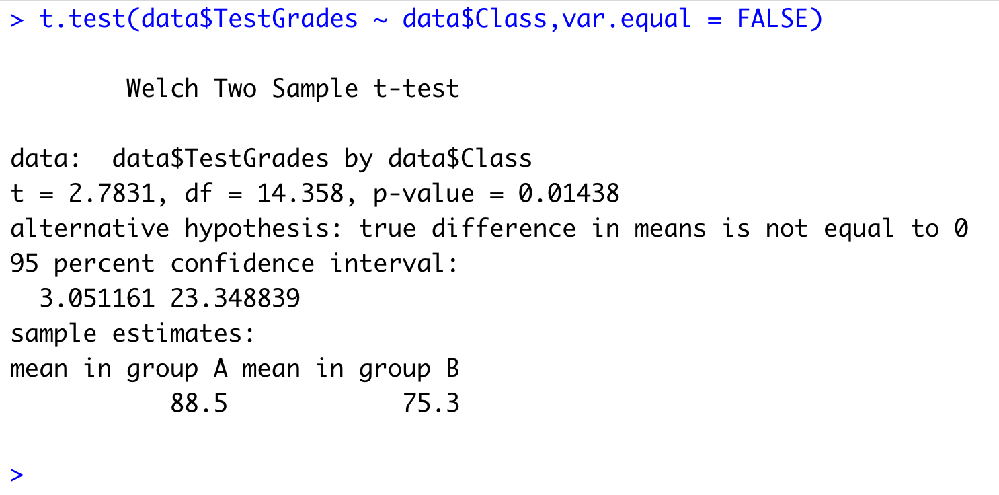
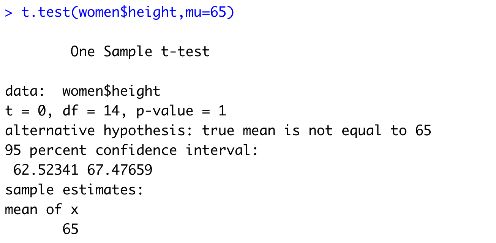
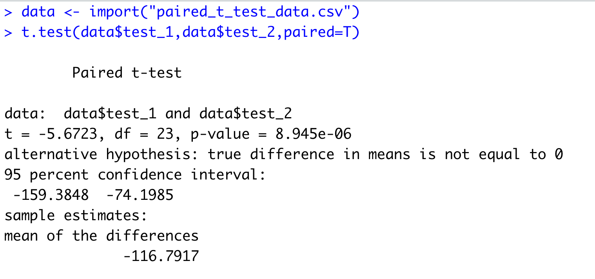

# Statistical tests in R

In this session, we will cover following

*  Why we do statistical test?
* How to do it?
* When to do which test?


### Why we do statistical test?

As we have already discussed that we often do not have access to entire population. Instead we have access to a small portion of population known as sample. We use this sample to infer knowledge about the population.

Following are  few example to explain it further.

* We collected  a sample of height data from  students studying in university X. We computed the average of our sample and obtained the average height of students in our sample. Now we want to test whether the average height found in our sample is the same for the population.
* We collected  two samples from  two universities' students' salary. We want to see is there any difference between average salary between two universities or not. 
* We collected two samples of test scores of  same classroom at the start of semester and end of semester.  We wanted to test whether the students test scores' were improved significanlty or not.
* We collected a salary sample of people working in Tallinn with their education levels (e.g., primary, secondary, bachelors, master, doctorate). We want to test is there any significant difference in salary among these various levels of education levels.


All these aforementioned examples illustrates some of the cases where we can apply the statistical test to test our assumption or guess (aka. hypothesis). One thing to note here is we are not just interested in finding knowledge for our sample, we want to rather use it to gain knowledge about the population.





The above diagram gives a pictorial representation of what we have just talked about. There are two classes- A and B. Let's say there are 100 and 80 students in class A and B, respectively. We collected sample of student's test scores data from both classes. In our sample, we have test scores for only few of students (let's say 35-40). We computed the average for both the samples and found that the sample-1 mean is higher than sample-2 mean. This is what we learned from our sample. Now, we want to see is it also the same for population (classroom-A average is higher than classroom-B average test scores or not). Here comes the statistical test. We use them to infer knowlege about population based on collected sample data.


### How to do it?

We will cover one sample t-test, independent sample t-test, paired t-test and ANOVA in R.

#### Independent sample t-test

We do this test when we have two independent samples and we want to campare a statistic for these two groups. For example, we want to compare the average salary of students working part-time from two different universities. In this case, we have two samples collected from different universities. These samples are independent because they contains data of different people.

Make sure the following assumption in your dataset when you do t-test

* Continuous dependent variable.
* Categorical independent variable for grouping.
* Independent data samples
* Dependent variable has a normal distribution.
* Each group has same variance.

We will look at above assumptions with the help of an example. Let's say we have test scores from two classes: A and B. Now we want to test whether the difference between these two classes' test score is significant or not.

| Class | TestScore |
| ----- | --------- |
| A     | 99        |
| A     | 93        |
| A     | 81        |
| A     | 92        |
| A     | 89        |
| A     | 80        |
| A     | 88        |
| A     | 81        |
| A     | 100       |
| A     | 82        |
| B     | 98        |
| B     | 66        |
| B     | 86        |
| B     | 62        |
| B     | 78        |
| B     | 87        |
| B     | 77        |
| B     | 60        |
| B     | 60        |
| B     | 79        |

You can see the dataset has one continuous variable (TestScore: Numeric type) and one class variable as grouping variable. This class variable tell the classrom from which the scores are collected.

Assumptions

* Continuous dependent variable: the dataset has continuous dependent variable (testScore).

* Categorical independent variable: the dataset has class variable which is a categorical variable( variable that has categories of value).

* The independence assumption can only be ensure while data collection. We assume here that the data were collected independently.

* Normal distribution: We can plot the test scores for each class and check for `bell shape`.

  ```R
  library(lattice)
  library(rio)

  # load dataset
  data <- import('data-file-name')

  # plot the distribution
  densityplot(~ data$TestScore|data$Class)
  ```


  

* Same variance in both groups (class A and B): We will compute the variance in both groups. We can use dplyr package for computing variance class wise.

  ```R
  data %>% group_by(Class) %>% summarise(var(TestScore))
  ```

  The variance for Class A and B are following

  | Class | Variance |
  | ----- | -------- |
  | A     | 55.8     |
  | B     | 169      |

  As we can see the variance is not same and the difference is not small.

  * If the variance is same, we will use [**Student's T-test**](https://en.wikipedia.org/wiki/Student%27s_t-test).
  * If the variance is not same then we will use [**Welsh T-test**](https://en.wikipedia.org/wiki/Welch%27s_t-test).

  In our dataset, the variance is not same therefore we will apply **Welsh t-test**.


##### Performing the test

We will first setup our hypothesis. We want to test that is there any difference between test scores' of class `A` and `B`. We will follow the below steps

1. State Null and alternative hypothesis
2. Decide significance level $\alpha$
3. Perform test
4. Check the `p-value` and decide 'whether to reject null hypothesis or not'


Now, let's talk for each step in detail.

The **first step**  is to formulate the `null` and `alternative` hypothesis. What are those? We specify what we want to test. For example, in our class's test scores  dataset, we want to test that the average test scores from two groups are different. It will become our `alternative` hypothesis. The null hypothesis is a hypothesis of no difference. In other words, the opposite of what we want to test. The below diagram is showing our null and alternative hypothesis.



The **second step** to decide the level of significance ($\alpha$). You can choose one of following .1%, 1%, 5%. For our example, let's select \alpha as 5% or .05.

The **third step** is to perform the test and obtain the **p-value**.

>  p-value =< $\alpha$ : $H_1$ hypothesis
>
> p-value > $\alpha$ : $H_0$ hypothesis
>

We will perform the t-test on out dataset in R.

```R
t.test(data$TestScore ~ data$Class, var.equal = FALSE)
```

We use `t.test()` function from R. We have specified the testscore and class variable. Here, testscore is dependent variable and class is independent variable. We have also specified that variance of groups are not equal. It automatically select `Welsh t-test` when we tell that the variance among groups is not same.



In the results, we can see `p-value`. We will compare it with $\alpha$. We can see that p-value is less than .05 (or our selected level of significance). Hence, we say that **null hypothesis is rejected** and alternative hypothesis can be accepted. From the results, we can also see that group-A mean is higher than group-B. We can say that the average tests cores from class A is **significanlty** higher than average test scores from class B.

#### One sample t-test

This is the most basic scenario for t-test. In our list of example, the first example is where we use one sample t-test. So if you have a single sample and you want to test whether the statistic (e.g., mean, variance, standard deviation) obtained from the sample is population statistic or not.

For this test, we will use `women` dataset from the R `datasets` package. This dataset has two attributes- height and weight of american women. We want to see whether the average height of american women is  65 (this is what we got from our sample) or not.

So here we setup following hypothesis

> H_0 : Average height is same as 65 (hypothesis of no difference)
>
> H_1: Average height is not same as 65.

Don't forget to test the assumptions for the t-test. In this case, we will go for testing the distribution is norm al or not. You can plot the histogram or density plot and check for `bell shape`.

We than set the level of significance as 5% (or .05)

Let's perform the test now.

```R
# load datasets package
library(datasets)

t.test(women$height,mu=65)
```




From our results from t-test, we can see that p-value is not less than .05 that means we can not reject our null hypothesis.

#### Paired t-test

Let's think about the third example which we have discussed in the start.

> We collected two samples of test scores of  same classroom at the start of semester and end of semester.  We wanted to test whether the students test scores' were improved significanlty or not.

For this exercise, we have following dataset of test scores of same students at the start of lecture and end of lecture.

| test-1 | test-2 |
| ------ | ------ |
| 175    | 296    |
| 329    | 376    |
| 238    | 309    |
| 60     | 222    |
| 271    | 150    |
| 291    | 316    |
| 364    | 321    |
| 402    | 447    |
| 70     | 220    |
| 335    | 375    |
| 300    | 310    |
| 245    | 310    |
| 186    | 282    |
| 31     | 317    |
| 104    | 362    |
| 132    | 338    |
| 94     | 263    |
| 38     | 138    |
| 62     | 329    |
| 139    | 292    |
| 94     | 275    |
| 48     | 150    |
| 68     | 319    |
| 138    | 300    |

So data were collected from same students. In this case, we will apply the paired t-test to test whether there is any improvement in students' test scores after attending the lecture or not.

We first need to test the assumptions (Skipped for it. You can check the assumptions [here](https://ncss-wpengine.netdna-ssl.com/wp-content/themes/ncss/pdf/Procedures/NCSS/Paired_T-Test.pdf)


We will set-up our hypothesis

> H_0 : There is no difference in students' test performance before and after the lecture (null hypothesis)
>
> H_1 : Theres is a difference in students' test performance before and after the lecture.

Then, we would set the level fo significance as 5% (.05).

We will perform the test now using the same function but this time we specify `paired` parameter as `TRUE`.




In the results, if we look at the `p-value` and that is **.00000894**. This value is smaller than $\alpha$ that means we can reject the null hypothesis. We accept the alternative hypothesis.


#### ANOVA

ANOVA or **AN**alysis **O**f **VA**riance test has its usage in different scenario and here we are going to talk about the most basic one. We use independent sample t-test when we have only two groups but when we have more than two groups we  employs ANOVA test.

Let's take an example. We have a diet datasets (you can download it from [here](https://www.sheffield.ac.uk/polopoly_fs/1.570199!/file/stcp-Rdataset-Diet.csv)). This dataset has attributes person id, gender, height, diet, weight before taking diet, weight after taking the diet. There were three different  diets were given. We want to test whether the diet has any impact over weight loss or not.

So first we compute the weight loss for each participants.

```R
> data <- import('anova_test_dataset_diet.csv')
> str(data)
'data.frame':	78 obs. of  7 variables:
 $ Person      : int  25 26 1 2 3 4 5 6 7 8 ...
 $ gender      : int  NA NA 0 0 0 0 0 0 0 0 ...
 $ Age         : int  41 32 22 46 55 33 50 50 37 28 ...
 $ Height      : int  171 174 159 192 170 171 170 201 174 176 ...
 $ pre.weight  : int  60 103 58 60 64 64 65 66 67 69 ...
 $ Diet        : int  2 2 1 1 1 1 1 1 1 1 ...
 $ weight6weeks: num  60 103 54.2 54 63.3 61.1 62.2 64 65 60.5 ...
```

```R
data$weightLoss <- data$pre.weight - data$weight6weeks
```

Now we will consider two attributes for our ANOVA test: weightLoss and type of diet.

Following are assumptions for the ANOVA test

* The dependent variable (weightLoss in our example) is normally distributed in each group (diet types in our example).
* The variance of dependent variable is same for all groups of independent variable.
* Independence data samples.

We use `aov()` function in R to perform ANOVA test.


Here, you need to look for `Pr(>F)` column that is `p-value` for ANOVA test. We can see this value is smaller than .05 (5% level of significance) and even also than .01 (1% level of significance). We can say the null hypothesis is rejected. You can refer this [link](https://bioinformatics-core-shared-training.github.io/linear-models-r/anova.html) for detailed analysis of the same.

### When to do which test?

You might be already wondering why we have so many test and how would I know when to apply what. To simplify it, you can refer the following

>  You have a single variable (continuous type or numeric in R) that you want to investigate and you are interested in finding some knowledge about population on that variable.
>
> **One sample t-test**


> You have two variables- one continuous and another with categories. The number of categories are two.
>
> **Independent Sample t-test**


> You have same scenario as above but now you have second variable with more than two categories.
>
> **ANOVA**


> You have two variables (both continuous) containing data collected from same participants.
>
> **Paired t-test**
